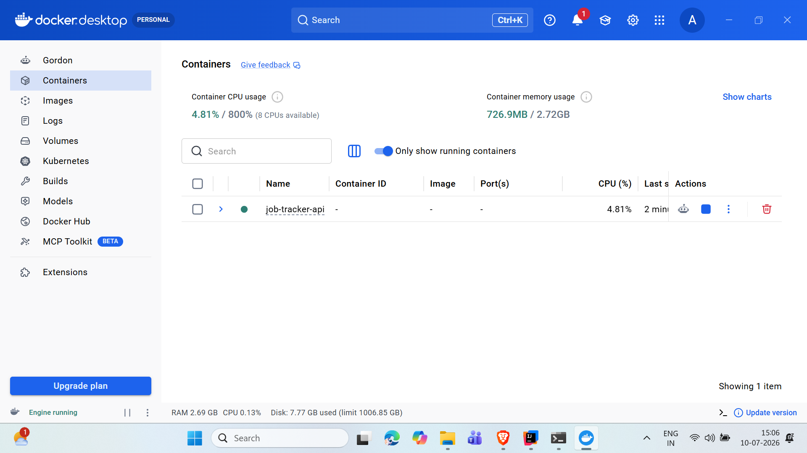
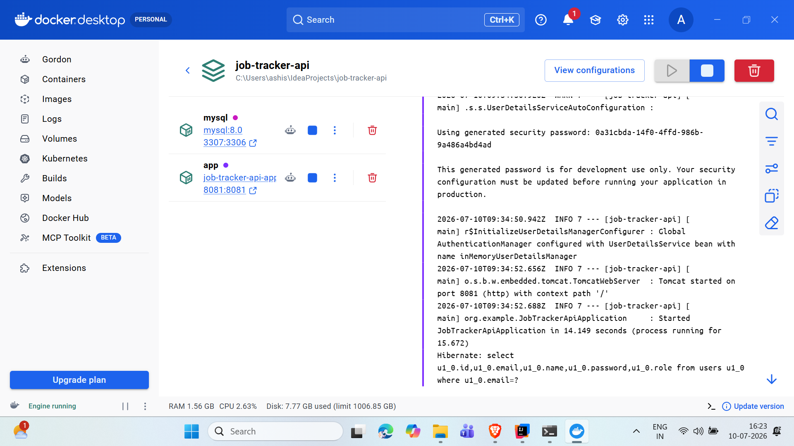
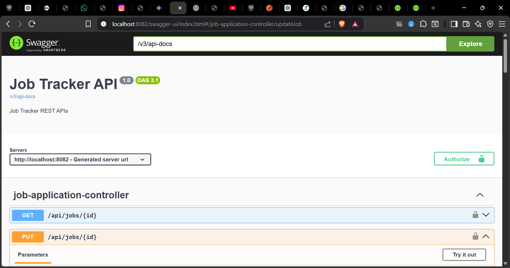
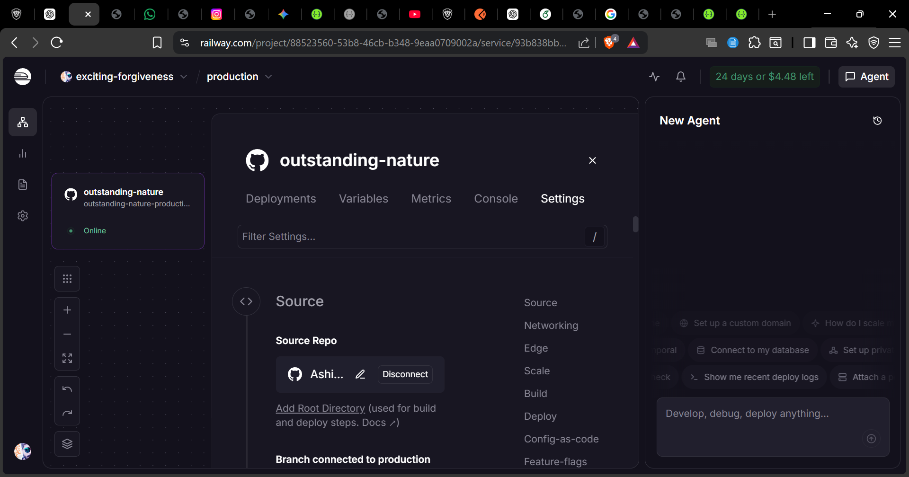
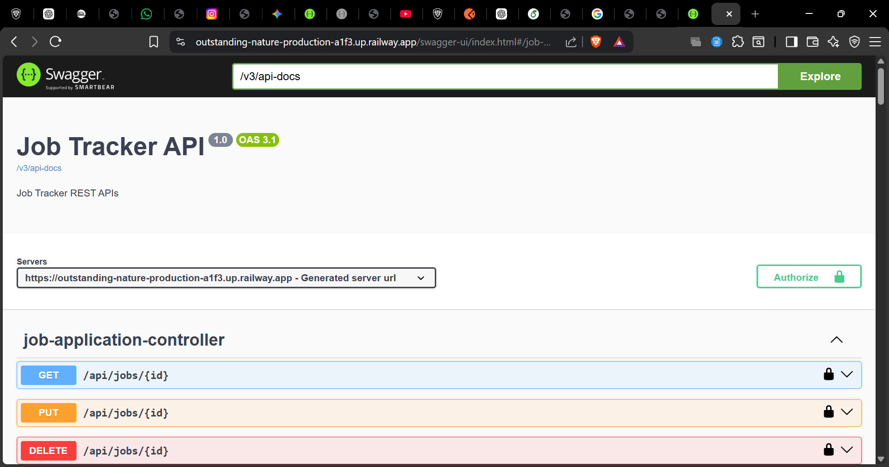
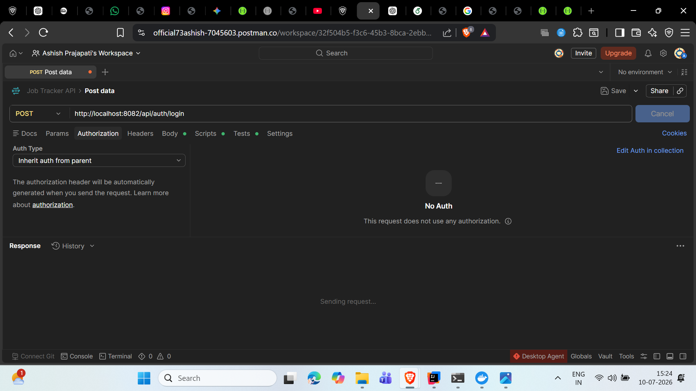

# 🚀 Job Tracker API

A production-ready **RESTful API** built with **Spring Boot** for managing job applications securely. The application uses **JWT Authentication**, **Role-Based Authorization**, **MySQL**, **Docker**, and is deployed on **Railway**. API documentation is available through **Swagger/OpenAPI**.

---

# 📑 Table of Contents

- [Features](#-features)
- [Tech Stack](#-tech-stack)
- [Project Structure](#-project-structure)
- [Getting Started](#-getting-started)
- [Run with Docker](#-run-with-docker)
- [API Documentation](#-api-documentation)
- [Authentication](#-authentication)
- [Main API Endpoints](#-main-api-endpoints)
- [Security](#-security)
- [Project Screenshots](#-project-screenshots)
- [Future Enhancements](#-future-enhancements)
- [Author](#-author)
- [License](#-license)

---

# ✨ Features

- 🔐 JWT Authentication
- 👥 Role-Based Authorization (USER / ADMIN)
- 💼 Job Application CRUD Operations
- 🔄 Update Job Status
- 📊 Dashboard Statistics
- 📄 Pagination Support
- 🔎 Sorting by Company & Status
- 📦 DTO-Based API Design
- 📖 Swagger/OpenAPI Documentation
- 🐳 Dockerized Application
- ☁️ Railway Deployment
- 👤 USER can manage only their own job applications
- 👑 ADMIN can manage all job applications and create new admins

---

# 🛠 Tech Stack

| Technology | Purpose |
|------------|---------|
| Java 21 | Programming Language |
| Spring Boot 3 | Backend Framework |
| Spring Security | Authentication & Authorization |
| JWT | Secure Authentication |
| Spring Data JPA | Database Access |
| Hibernate | ORM |
| MySQL | Database |
| Maven | Dependency Management |
| Docker & Docker Compose | Containerization |
| Railway | Cloud Deployment |
| Swagger / OpenAPI | API Documentation |

---

# 📂 Project Structure

```text
src
├── config
├── controller
├── dto
├── entity
├── exception
├── repository
├── security
└── service
```

---

# 🚀 Getting Started

## Clone the Repository

```bash
git clone https://github.com/Ashish3435/job-tracker-api.git
```

## Navigate to the Project

```bash
cd job-tracker-api
```

## Configure Database

Update the following properties in `application.properties`:

```properties
spring.datasource.url=
spring.datasource.username=
spring.datasource.password=

jwt.secret=
jwt.expiration=
```

## Run the Application

```bash
./mvnw spring-boot:run
```

The application starts on:

```
http://localhost:8082
```

---

# 🐳 Run with Docker

Build and start the application:

```bash
docker compose up --build
```

After the containers start successfully:

Application:

```
http://localhost:8081
```

Swagger UI:

```
http://localhost:8081/swagger-ui/index.html
```

---

# 📖 API Documentation

## Local

```
http://localhost:8082/swagger-ui/index.html
```

## Docker

```
http://localhost:8081/swagger-ui/index.html
```

## Railway (Live API)

```
https://outstanding-nature-production-a1f3.up.railway.app
```

## Railway Swagger

```
https://outstanding-nature-production-a1f3.up.railway.app/swagger-ui/index.html
```

---

# 🔐 Authentication

The API uses **JWT Authentication**.

### Steps

1. Register a new user.
2. Login using your credentials.
3. Copy the generated JWT token.
4. Open Swagger UI.
5. Click **Authorize**.
6. Enter:

```text
Bearer YOUR_JWT_TOKEN
```

7. Execute secured endpoints.

---

# 📌 Main API Endpoints

| Method | Endpoint | Description |
|--------|----------|-------------|
| POST | `/api/auth/register` | Register User |
| POST | `/api/auth/login` | Login User |
| POST | `/api/auth/create-admin` | Create Admin (ADMIN Only) |
| GET | `/api/auth/me` | Current Logged-in User |
| POST | `/api/jobs` | Create Job |
| GET | `/api/jobs` | Get All Jobs |
| GET | `/api/jobs/{id}` | Get Job by ID |
| PUT | `/api/jobs/{id}` | Update Job |
| PUT | `/api/jobs/{id}/status` | Update Job Status |
| DELETE | `/api/jobs/{id}` | Delete Job |
| GET | `/api/jobs/dashboard` | Dashboard Statistics |
| GET | `/api/jobs/my-dashboard` | Current User Dashboard |
| GET | `/api/jobs/my-jobs` | Logged-in User Jobs |
| GET | `/api/jobs/company/{company}` | Filter by Company |
| GET | `/api/jobs/status/{status}` | Filter by Status |
| GET | `/api/jobs/page` | Pagination |
| GET | `/api/jobs/sort/company` | Sort by Company |
| GET | `/api/jobs/sort/status` | Sort by Status |
| GET | `/api/jobs/dto` | DTO Response |
| GET | `/api/jobs/dto/{id}` | DTO by ID |

---

# 🔒 Security

- Passwords encrypted using BCrypt
- JWT Token Authentication
- Stateless Session Management
- Role-Based Authorization
- Protected REST APIs using Spring Security

---

# 📸 Project Screenshots

## 🐳 Docker Containers



---

## 🐳 Docker Compose Running



---

## 📖 Local Swagger UI



---

## ☁️ Railway Deployment



---

## 🌍 Production Swagger UI



---

## 🧪 Postman API Testing



---

# 🚀 Future Enhancements

- 📄 Resume Upload
- 📧 Email Notifications
- ⏰ Interview Reminder Scheduler
- ✅ Unit Testing
- ✅ Integration Testing
- 🔄 CI/CD with GitHub Actions
- 🌐 React Frontend
- 📱 Mobile App Integration

---

# 👨‍💻 Author

**Ashish Prajapati**

GitHub:  
https://github.com/Ashish3435

---

# 📄 License

This project is licensed under the **MIT License**.